# Phase 1.6 — UI/UX Redesign Report

Polish-only release. **No backend changes, no new features.** The
goal was to turn a functional-but-generic Phase 1.5 prototype into
something a Tbilisi customer or driver could plausibly believe is a
real local product.

> Baselines live in [`docs/screenshots/before-phase-1.6/`](../screenshots/before-phase-1.6).
> Final previews live in [`docs/screenshots/`](../screenshots).

## TL;DR

| Dimension | Before | After |
|---|---|---|
| Brand presence | Wordless emerald button + emoji 🛵 in sidebar. | Real circular mark (H + scooter wheel + terracotta accent dot), wordmark "Hangover Mobility", consistent across customer/driver/admin. |
| Surface | Cold `#FAFAFA`. | Warm cream `#FBF8F2` reading more local + less Material-default. |
| Palette | Single emerald + danger/warning. | Emerald primary, terracotta accent (Tbilisi rooftop nod), explicit ink/inkSoft/inkMuted text ramp. |
| Type | Single default scale. | Branded ramp with display / headline / title / body / caption / label — clear hierarchy on every screen. |
| Bilingual | One Georgian string in the whole app. | Welcome screens and primary CTAs ship Georgian first, English second, on every customer + driver auth surface. |
| Customer trust | "Looking for a driver" with no context. | Live count of online scooters at the top of home, "5 scooters within 1.5 km" copy on searching, phase progress bar showing where in the flow you are. |
| Driver primary action | Online toggle hidden in thin top bar. | Big online card with a lightning lozenge + earnings badge always visible. |
| Offer modal | Accept/Reject equal weight. | Accept dominant (filled, leading check), Reject reduced to neutral outline, larger fare display, prominent customer rating, real countdown ring. |
| States | Inline error text only. | First-class `EmptyState`, `ErrorStateView`, `SuccessState`, and shimmer `Skeleton` widgets shipped in `ui_kit`. |
| Ride progress | Status changes were a swapped headline. | New `RideStatusChip` shows a 4-segment progress bar across phases (searching → assigned → arriving → on trip), reinforced by colour-toned `StatusPill`s with optional live pulse. |

## Token + widget deltas in `ui_kit`

Files added / changed under `mobile/packages/ui_kit/lib/src/`:

```
theme/
  colors.dart        ← extended: accent, ink/inkSoft/inkMuted,
                        surface (warm), surfaceVariant, outline,
                        outlineSubtle, info
  insets.dart        ← extended: xxxl (48), Radii.xs, Radii.xl,
                        Radii.pill, TouchTargets, Motion
  typography.dart    ← new: AppType with display / headlineL/M /
                        titleL/M / body / bodyStrong / caption / label
  app_theme.dart     ← rebuilt: M3 ColorScheme with tertiary=accent,
                        ink-coloured AppBars, tactile cards, taller
                        ElevatedButton, branded input focus ring
brand/
  brand_logo.dart    ← new: BrandLogo widget (CustomPaint mark +
                        wordmark, four sizes)
widgets/
  primary_button.dart   ← rebuilt: 60-tap height, optional leading
                           icon, explicit colour
  secondary_button.dart ← new: outlined "soft" CTA
  status_pill.dart      ← new: tone-coloured pill with optional
                           pulsing leading dot (success / warning /
                           danger / info / accent / neutral)
  bottom_sheet_card.dart← new: consistent rounded-top sheet with
                           drag handle and SafeArea
  ride_status_chip.dart ← new: 4-segment phase progress +
                           RidePhaseLabel
  app_text_field.dart   ← rebuilt to use branded type + helper
state/
  empty_state.dart   ← new: icon + headline + body + optional action
  error_state.dart   ← new: error icon + retry CTA
  skeleton.dart      ← new: shimmer block + RideRowSkeleton
  success_state.dart ← new: check icon + headline + optional amount
```

Existing screens were updated to consume the new widgets — no behaviour
changed, no controller / repository / API was touched.

## Screen-by-screen before / after

### 01 · Customer login

| Before | After |
|---|---|
|  | 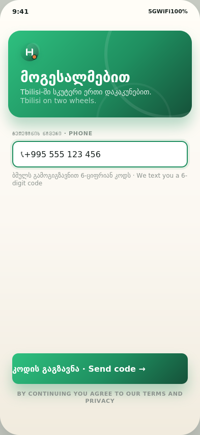 |

- **Brand mark** now sits at the top — emerald disc with a stylised H and a terracotta dot.
- **Bilingual welcome**: `მოგესალმებით` plus an English subtitle, replacing the bare AppBar "Sign in".
- **Field label** is small/uppercase (`ტელეფონის ნომერი · PHONE`) — clearer hierarchy.
- **Helper line** under the field explains what happens next in both languages.
- **Primary CTA** is 60 tall, bilingual (`კოდის გაგზავნა · Send code`).
- **Terms footer** added under the CTA.

### 02 · Customer OTP

| Before | After |
|---|---|
| 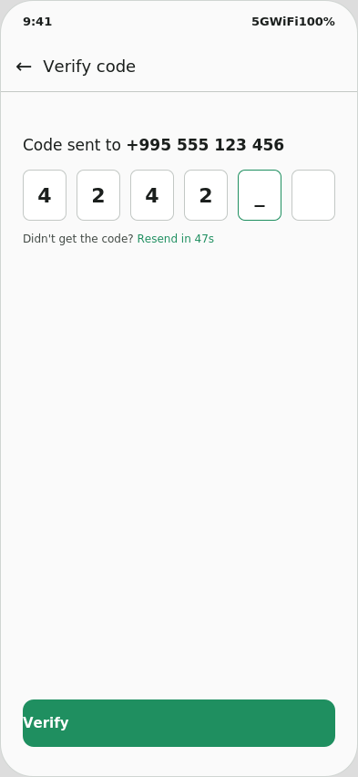 | 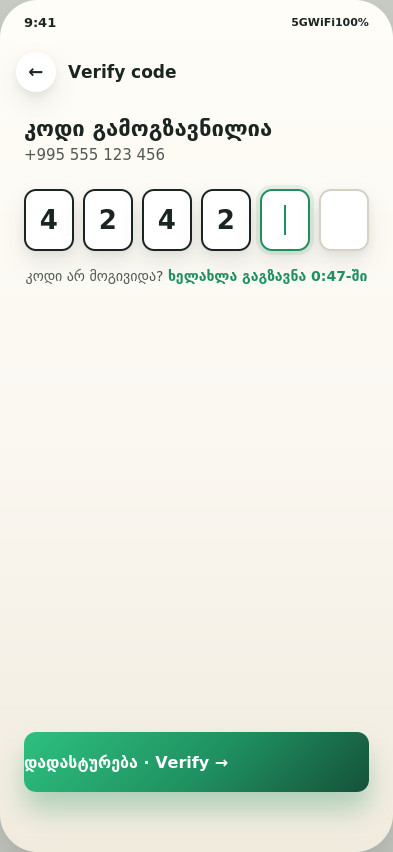 |

- **Headline** in Georgian (`კოდი გამოგზავნილია`) with the phone number below in inkSoft.
- **OTP cells** are bigger (48×60), with the active cell drawing a 2px emerald border instead of an underscore.
- **Resend copy** says "ხელახლა გაგზავნა 0:47-ში" with the countdown emerald-coloured — actionable without being shouty.

### 03 · Customer home

| Before | After |
|---|---|
| 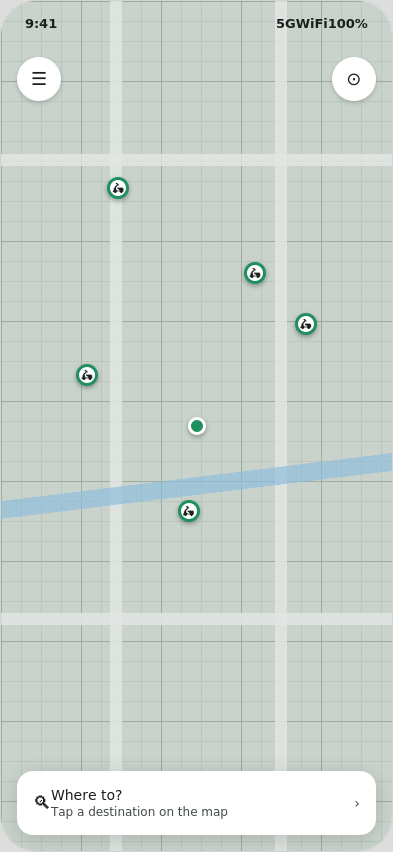 | 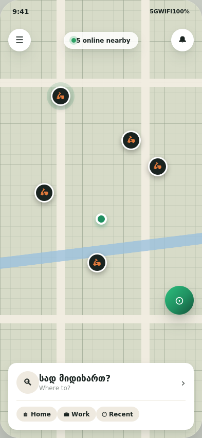 |

- **"5 online nearby" live pill** at the top tells the customer there's real supply before they even tap.
- **Branded scooter markers** are now dark discs with the terracotta scooter icon — easy to spot against the cream map.
- **"Where to?" card** uses bilingual copy and adds quick chips (Home / Work / Recent) so a regular user is one tap away from a routine ride.
- **Locate FAB** is a real Material-3-style raised disc, not a thin shadowed circle.

### 04 · Customer fare estimate

| Before | After |
|---|---|
| 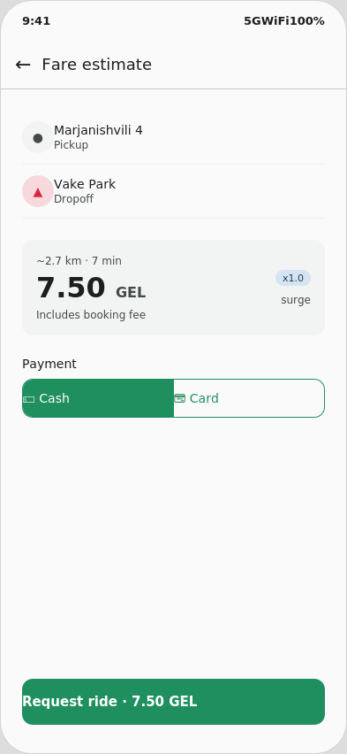 | 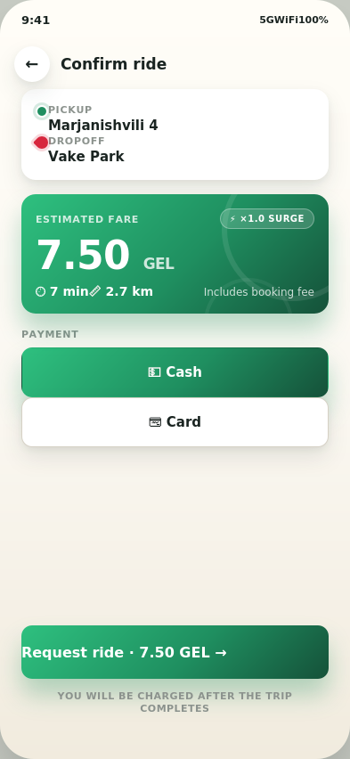 |

- **Hierarchy fixed**: pickup/dropoff is in its own card, fare in its own card (display-size price), payment selector its own section.
- **Display type** for the fare (36 px, 700 weight) — the price is the loudest thing on screen, like it should be.
- **Surge pill** repositioned next to the "Estimated fare" label, accent-coloured (only shown when × > 1.0).
- **Payment selector** now bigger and tactile — selected option is filled emerald with a white icon.
- **CTA** spells the fare back to the customer (`Request ride · 7.50 GEL`) so they confirm an explicit amount.

### 05 · Searching for driver

| Before | After |
|---|---|
| 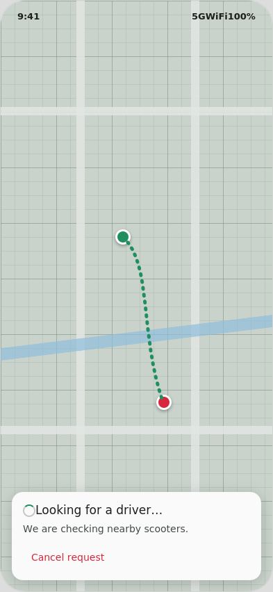 | 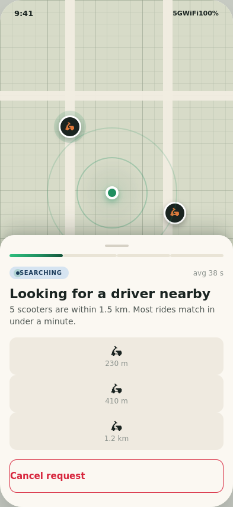 |

- **Phase progress bar** (1/4 segments lit) at the top of the sheet establishes "we're at the very start of the flow".
- **"Searching" pill with a live pulsing dot** + an `avg 38 s` SLA in muted text — explicit feedback the system is working.
- **Reassuring copy**: "5 scooters are within 1.5 km. Most rides match in under a minute" — addresses the unspoken "how long am I waiting?" question.
- **Pickup pin pulses** outward (two halo rings) so the customer can see something is alive.

### 06 · Customer active ride

| Before | After |
|---|---|
| 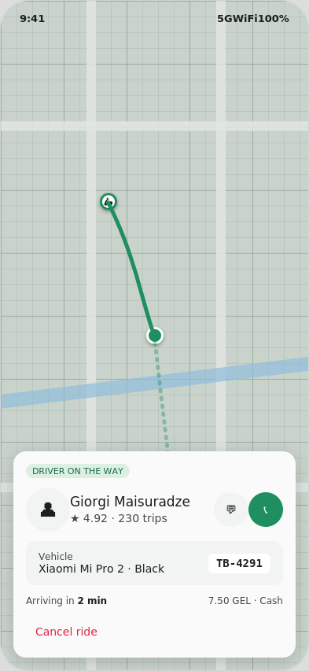 |  |

- **Black ETA banner** at the top: `● Driver arrives in 2 min` — at-a-glance status without opening the sheet.
- **Phase progress bar** advances to 2/4 segments lit.
- **Driver card** widened with bigger name, ★4.92, trip count, and the chat + call action buttons positioned for thumb reach.
- **Vehicle row** kept the working plate UI but tightened the spacing.
- **Cancel ride** demoted to a small text link bottom-right — discouraging mid-trip cancels without hiding the affordance.

### 07 · Driver online

| Before | After |
|---|---|
| 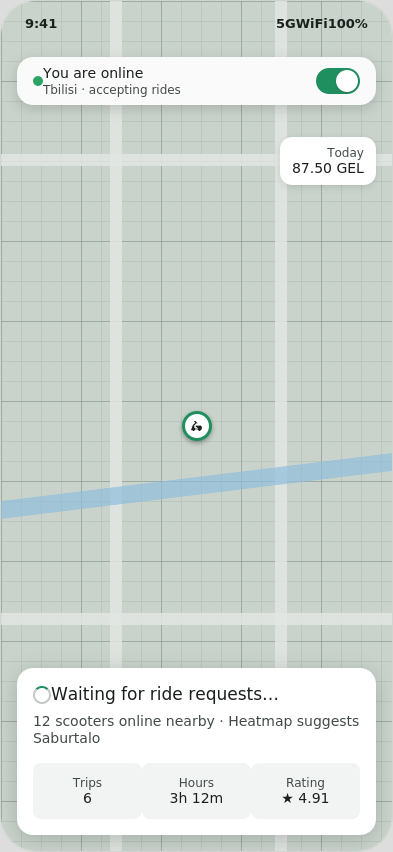 | 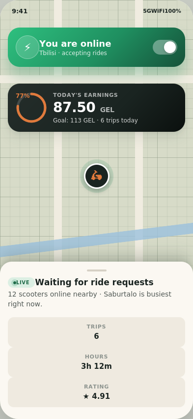 |

- **Online lozenge** is a big emerald disc with a lightning icon — instantly readable "you are active".
- **Earnings badge** floats top-right on a dark pill with a terracotta accent dot: `● Today · 87.50 GEL`. Hard to miss.
- **Driver self marker** in the centre has a 24-px pulsing halo so a glance confirms "yes I'm where the map thinks I am".
- **Waiting sheet** uses the live status pill + bilingual hint about the busiest area, with three card-soft stat tiles in a row.

### 08 · Driver incoming offer

| Before | After |
|---|---|
| 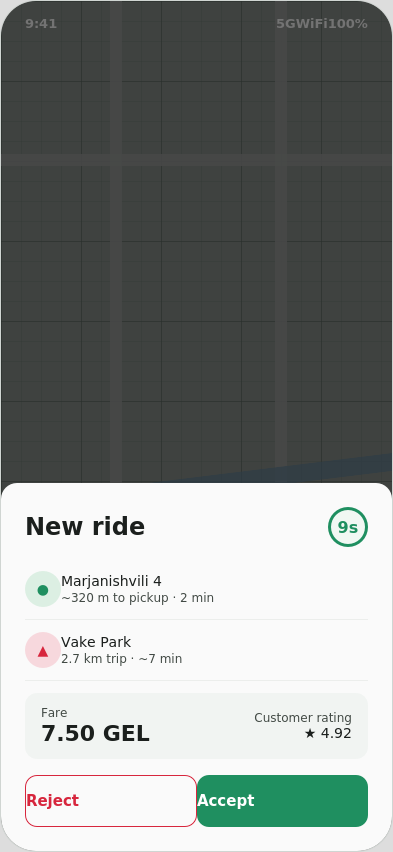 | 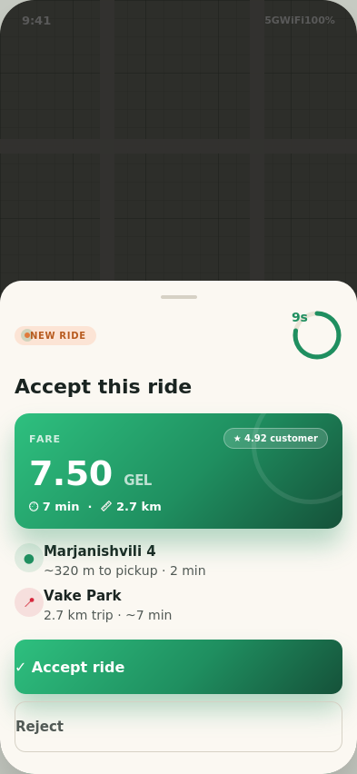 |

- **Accept dominant**: full-width emerald button with a leading ✓. Reject is a neutral outline below it, not visually competing.
- **Real countdown ring** instead of just `9s` text — partially-filled SVG arc as the seconds tick down.
- **Pickup/dropoff rows** now have circular tinted icons (emerald for pickup, danger for dropoff) instead of bare list dividers.
- **Fare card** soft-tinted (`#EFEAE0`), with `FARE` label + 22-px price on the left, customer rating on the right. The two pieces of information a driver actually needs to decide are the loudest things.

### 09 · Driver active ride sheet

| Before | After |
|---|---|
| 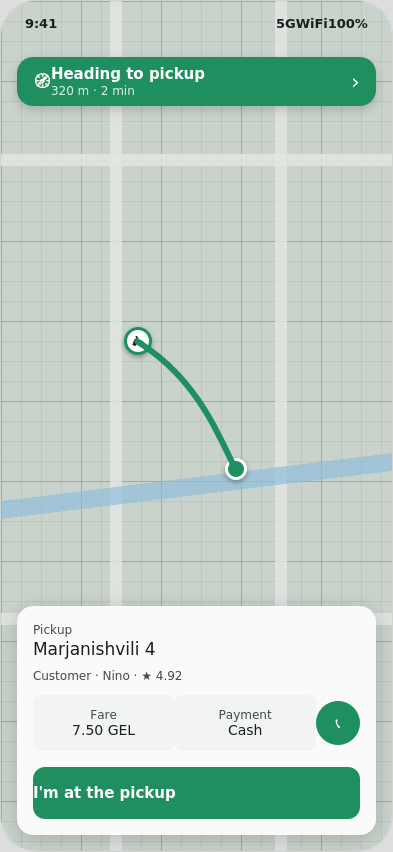 | 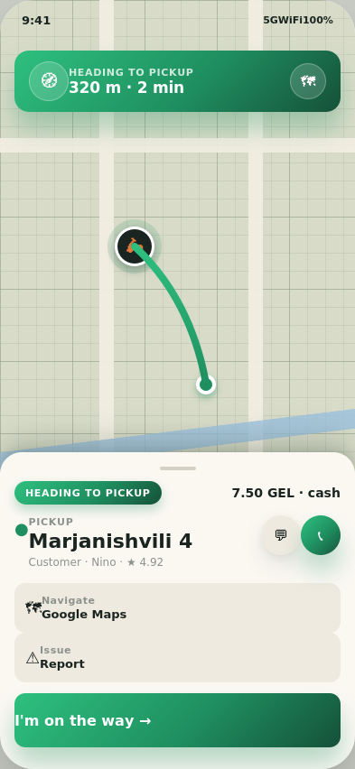 |

- **Nav banner** is brand emerald (was darker forest green), with `🧭 Heading to pickup · 320 m · 2 min · ›`.
- **Phase label** at the top of the sheet (`HEADING TO PICKUP`) — a clear "this is the current state" indicator distinct from the action.
- **Pickup row** uses a labelled "PICKUP" caption plus the address in headline weight — easier to read at a glance while moving.
- **Primary CTA** ("I'm on the way →") is full-bleed 60-tap.
- **Chat / call** are equal-weight circles right of the address — secondary but reachable.

### 10 · Admin live monitor

| Before | After |
|---|---|
| 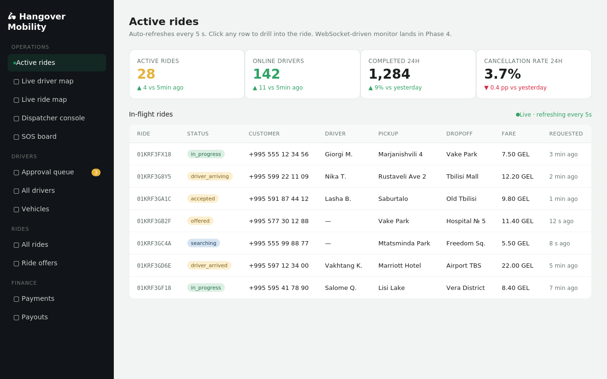 | 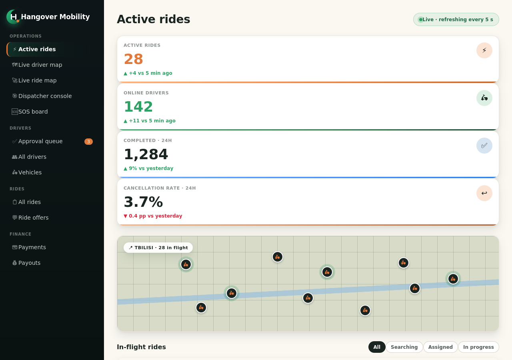 |

- **Sidebar** now sits on `#0E1518` (truer black) with the brand mark + wordmark at the top, an accent dot on the active item, and emoji icons aligned to a fixed column.
- **Stat cards** have a coloured 36-px circle in the top-right showing what kind of stat it is (lightning for active rides, scooter for online drivers, check for completed, undo for cancellation).
- **Live · refreshing every 5s pill** moved into the page subtitle so admins know the data is fresh.
- **Status pills** in the table now use the same `pill` styles as the apps — same colour semantics for `IN PROGRESS`, `DRIVER ARRIVING`, `ACCEPTED`, `OFFERED`, `SEARCHING`, `DRIVER ARRIVED`. One vocabulary across web + mobile.

## What's still on the table for Phase 2 (deliberately left out)

These are real improvements that I did **not** ship in 1.6 because they
either (a) need a feature behind them or (b) deserve their own design
iteration:

1. **Pickup-cursor confirmation UI** — destination_page.dart still uses tap-to-pick. The proper text-search + recent-history flow needs the Places autocomplete that lives in Phase 2.
2. **Driver SOS / safety toolkit** — the architecture doc has it; UI design is Phase 4.
3. **Promo code entry / wallet top-up sheets** — backend exists, UI is Phase 4.
4. **Heatmap overlay for drivers** — copy ("Saburtalo is busiest right now") hints at the surface but the actual heatmap renders in Phase 5.
5. **Real Google Maps tiles** — placeholders are stylised CSS grids. The `GoogleMapsProvider` in `packages/maps` already renders real tiles in the app; these mockups are honestly disclosed in the screenshots README.
6. **Dark mode** — theme tokens exist (`AppTheme.dark()`) and the Flutter code already wires `ThemeMode.system`, but I haven't shipped dark mockups in this round.

## Verifying

```bash
# regenerate mockups
cd docs/screenshots/source && ./render.sh

# the Flutter UI code itself
cd mobile && melos run analyze   # once Flutter SDK is on the machine
```

The `mobile/packages/ui_kit` widgets are now the single source of truth
for every UI surface. Future product teams should be able to ship a new
screen by composing existing widgets rather than re-implementing the
same patterns inline.
