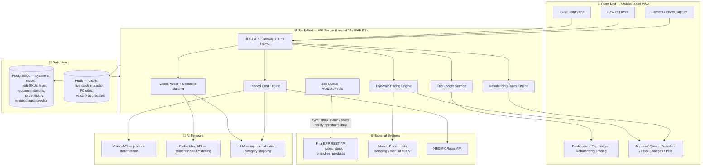

# AI Executive Director & Smart Buyer Assistant

## Project Requirements Document (PRD) & Technical Architecture

**Company:** Gadget (LLC Lizi) · **ERP:** Fina (REST API) · **Version:** 1.0 · **Date:** June 2026

-----

## 1. Executive Summary

### 1.1 The Paradigm Shift

Today, purchasing, stock allocation, and pricing at Gadget are three disconnected, human-driven processes. The buyer in China estimates landed costs mentally; branch managers request transfers reactively; price changes happen when someone notices dead stock. Each decision is made with partial information and after the fact.

The **AI Executive Director** collapses these three loops into one continuously running optimization engine sitting on top of Fina:

|Dimension       |Today (Manual)                                  |With AI Executive Director                                                            |
|----------------|------------------------------------------------|--------------------------------------------------------------------------------------|
|Purchasing      |Gut-feel buying in China, cost known weeks later|Photo/tag → instant 80–90% accurate landed cost in GEL, gap-driven buy recommendations|
|Stock allocation|Reactive transfers after stockouts              |Daily proactive rebalancing recommendations across 10+ branches                       |
|Pricing         |Static prices, dead stock discovered late       |Automated markdown/markup triggers tied to velocity and market data                   |
|Trip economics  |Reconstructed from receipts post-trip           |Live Trip Ledger: CBM, FX, landed cost, projected margin in real time                 |

The system is **decision-support first, automation second**: every recommendation (transfer order, price change, purchase order) is generated by the engine but approved by a human in Phase 1–2, with optional auto-execution thresholds in Phase 3. Fina remains the single source of truth for transactions; this platform is the intelligence layer above it.

### 1.2 Success Metrics (12-month targets)

- Landed cost estimate accuracy: ≥85% vs. actual (within ±15%)
- Dead stock (>120 days no movement) value: −40%
- Inter-branch stockout incidents on A-class SKUs: −60%
- Gross margin uplift from dynamic pricing on star products: +2–4 p.p.
- Buyer time per China trip spent on cost math: −80%

-----

## 2. Technical Architecture

### 2.1 System Diagram (Mermaid)



### 2.2 Component Notes

**Front-End — Mobile-first PWA (React/Next.js).** The buyer in Shenzhen works on a phone with unstable connectivity: the PWA must support offline capture (photos + tags queued locally, synced when online). Tablet/desktop views serve the Tbilisi-side dashboards and approval queues.

**Back-End — Laravel 11.** Chosen deliberately to align with the existing Martva platform stack, allowing shared Fina API client code, shared auth, and eventual embedding of this module inside Martva rather than running a parallel system. Horizon + Redis queues handle all Fina sync jobs and AI calls asynchronously.

**Fina Sync Cycles (pull-based, read-mostly):**

|Data                           |Frequency       |Method                                                                                            |
|-------------------------------|----------------|--------------------------------------------------------------------------------------------------|
|Stock balances per branch      |Every 15 min    |Incremental pull → Redis snapshot + PG history                                                    |
|Sales transactions             |Hourly          |Delta pull by document date → PG `sales_facts`                                                    |
|Product master / hierarchy     |Daily (03:00)   |Full pull, diffed → PG `fina_products`                                                            |
|Writes to Fina (POs, transfers)|On approval only|Push via Fina REST write endpoints; if unavailable, generate import-ready files for manual posting|

**AI Hooks.** Vision API for photo → category/attribute extraction; embedding model (stored in `pgvector`) for supplier-Excel-row → Fina-product matching; LLM for messy Chinese/English tag normalization. All AI calls are queued, retried, and cached by content hash to control cost.

**Why PostgreSQL (not MySQL):** native `pgvector` for semantic matching, materialized views for velocity aggregates, and window functions for days-of-supply calculations. Redis holds only hot, rebuildable state.

-----

## 3. Data Layer & SKU Mapping Strategy

### 3.1 The Generic SKU Problem

Fina tracks high-variance categories (phone cases, screen protectors, cables) under **one generic SKU** (e.g., `CASE-GEN-001` = "Phone Case, assorted"). Fina therefore knows *how many cases* sold, but not *which model, color, or style*. Purchasing decisions, however, depend exactly on those attributes.

### 3.2 Solution: Purchasing Sub-SKU Overlay

The platform never modifies Fina's SKU structure. Instead it maintains a **virtual sub-SKU layer** in PostgreSQL that decomposes each generic Fina SKU into trackable purchasing units:

```
fina_products (mirror of Fina master)
└── 1:N → sub_skus
            ├── sub_sku_code        e.g. CASE-GEN-001/IP15PM-BLK-MAG
            ├── fina_sku_id (FK)
            ├── attributes JSONB    {"device_model":"iPhone 15 Pro Max",
            │                        "color":"Black","brand":"Baseus",
            │                        "style":"MagSafe clear"}
            ├── trend_weight        0.00–1.00 (AI-maintained)
            ├── embedding VECTOR    for semantic matching
            └── lifecycle_status    rising / stable / declining / obsolete
```

**Three data flows feed the sub-SKU layer:**

1. **Inbound (purchasing):** every purchase line from a trip is recorded at sub-SKU level (the buyer photographed/tagged the exact item), so inbound quantities per sub-SKU are exact.
2. **Outbound (sales estimation):** Fina reports only generic-SKU sales. The system **disaggregates** generic sales across sub-SKUs using an estimator:

```
est_sold(sub_i) = generic_sold × W_i
W_i ∝ stock_share_i × trend_weight_i        (normalized so Σ W_i = 1)
```

Periodic physical counts and POS notes (where available) recalibrate the weights. The disaggregation is explicitly labeled as *estimated* in all UI — never presented as ERP fact.

3. **Trend weights:** updated weekly by the AI from (a) device-model sales mix in Fina (phones sold → cases needed), (b) sub-SKU sell-through estimates, (c) market signals (new device launches automatically spawn "rising" sub-SKUs and decay obsolete ones).

### 3.3 Core Schema (simplified)

```sql
fina_products(id, fina_sku, name_ka, name_en, category_id, unit, is_generic bool)
sub_skus(id, fina_product_id, sub_sku_code, attributes jsonb,
         trend_weight numeric, lifecycle_status, embedding vector(1536))
branches(id, fina_branch_id, name, region, sales_weight)
stock_snapshots(branch_id, fina_product_id, qty, snapshot_at)        -- 15-min grain
sales_facts(id, branch_id, fina_product_id, qty, net_amount_gel, sold_at)
trips(id, name, depart_at, return_at, overhead_total_usd, fx_usd_gel, fx_rmb_usd, status)
purchase_lines(id, trip_id, sub_sku_id, qty, unit_price_rmb,
               unit_cbm numeric, photo_url, landed_cost_gel, status)
transfer_recommendations(id, sub_or_fina_sku, from_branch, to_branch, qty,
               reason jsonb, score, status, decided_by, decided_at)
price_recommendations(id, fina_product_id, current_price, recommended_price,
               direction, trigger jsonb, status, decided_by, decided_at)
market_prices(id, fina_product_id, competitor, price_gel, captured_at, source)
```

-----

## 4. Algorithmic Logic Specifications

### 4.1 Landed Cost Calculation (Pillar A)

**Inputs:** unit price (RMB), unit volume (CBM), trip context (FX rates, overheads, total trip CBM), import duties/VAT profile per category.

```
Step 1 — Convert purchase price:
  unit_price_usd = unit_price_rmb / fx_rmb_usd
  unit_price_gel = unit_price_usd × fx_usd_gel

Step 2 — Freight (volumetric):
  freight_usd    = unit_cbm × 250                    # fixed $250/CBM China→Tbilisi
  freight_gel    = freight_usd × fx_usd_gel

Step 3 — Trip overhead allocation (proportional by CBM):
  overhead_gel   = (unit_cbm / trip_total_cbm) × trip_overhead_total_gel
  # trip_overhead_total = flights + lodging + local transport + agent fees …
  # During the trip, trip_total_cbm is a running estimate; finalized at trip close.

Step 4 — Import costs:
  customs_gel    = (unit_price_gel + freight_gel) × duty_rate(category)
  vat_gel        = (unit_price_gel + freight_gel + customs_gel) × 0.18   # if applicable

Step 5 — Landed cost:
  LANDED_COST_GEL = unit_price_gel + freight_gel + overhead_gel
                    + customs_gel + vat_gel

Confidence band (in-field mode):
  ±10–20% driven by: CBM estimate quality (photo-based volume estimate vs.
  supplier-declared), FX volatility buffer (±2%), and overhead estimate maturity.
  UI always shows: point estimate + range, e.g. "₾14.20 (₾12.80–₾15.90)"
```

**Vision flow:** photo → Vision API → `{category, candidate attributes}` → match to nearest `fina_product` / `sub_sku` via embedding similarity → pull that category's historical avg CBM/unit and duty profile as defaults → buyer confirms/edits → landed cost rendered in <3 seconds.

### 4.2 Inter-Branch Stock Rebalancing (Pillar B)

**Core metrics, computed daily per (branch, SKU):**

```
velocity_b,s        = avg daily units sold, 28-day window, recency-weighted
                      (weights: last 7d ×2, prior 21d ×1)
days_of_supply_b,s  = current_stock_b,s / max(velocity_b,s, ε)
network_DOS_s       = Σ stock / Σ velocity across all branches
```

**Trigger rules (all must hold to generate a recommendation):**

```
DONOR branch A:     days_of_supply(A,s) > 60          # overstock
                    AND stock(A,s) > safety_stock(A,s)
RECEIVER branch B:  days_of_supply(B,s) < 14          # at risk / stockout
                    OR stock(B,s) = 0 AND velocity(B,s) > 0
ECONOMIC GATE:      transfer_qty × unit_margin_gel > transfer_cost_threshold
                    (default threshold ₾30 — don't move 2 cables across town)
QUANTITY:           qty = min( stock(A) − target_DOS_A × velocity(A),
                               (target_DOS_B − DOS_B) × velocity(B) )
                    target_DOS_A = 45, target_DOS_B = 30
```

**Scoring & ranking:** each recommendation gets
`score = expected_recaptured_sales_gel × stockout_urgency × (1 − transfer_friction)`,
and the daily digest shows the top-N by score. Recommendations carry full reasoning JSON ("Saburtalo: 84 DOS, Gldani: 0 units / 1.4 units-day velocity → move 20").

**Guards:** no recommendation for SKUs with <14 days of sales history at the receiver; seasonal items use a seasonality-adjusted velocity; a SKU/branch pair recommended and rejected by a manager is suppressed for 14 days (with rejection reason captured for model feedback).

### 4.3 Dynamic Pricing Triggers (Pillar C)

**Markdown (liquidation) triggers — ANY of:**

```
T1: days_of_supply(network) > 180  AND  velocity_trend < 0
T2: zero sales in 60 days          AND  stock > 0
T3: lifecycle_status = obsolete    (e.g., case for a 3-generation-old phone)
T4: newer-generation replacement SKU in stock with ≥3× the velocity
```

**Markdown ladder (recommended, manager-approved):**

```
Stage 1: −15%   → re-evaluate after 21 days
Stage 2: −30%   → re-evaluate after 21 days
Stage 3: −50% or bundle/clearance channel → final
Floor:   price ≥ landed_cost × (1 − cash_recovery_tolerance)
         default tolerance 20% below cost for Stage 3 only (cash > dead stock)
```

**Markup (star product) triggers — ALL of:**

```
M1: velocity percentile ≥ 90th within category (28-day window)
M2: days_of_supply(network) < 21 AND replenishment lead time > DOS
M3: market check: our_price ≤ median(market_prices) − 5%
    (from scraped/imported competitor data, max 7 days old)
M4: price elasticity guard: last markup on this SKU did not reduce
    weekly unit sales by >10%
→ Recommend +5% to +15%, capped at median(market_price) × 0.98
  (stay marginally below market median to protect conversion)
```

**Post-change monitoring:** every executed price change opens a 14-day observation window; if unit velocity drops beyond the elasticity guard, an automatic rollback recommendation is generated. All price history is retained for elasticity learning per category.

-----

## 5. Feature Roadmap

### Phase 1 — MVP: Landed Cost + Vision (Weeks 1–6)

- PWA with offline photo/tag capture
- Landed Cost Engine (full formula, FX via NBG API, manual trip overhead entry)
- Vision → category identification → Fina product matching (read-only daily product pull)
- Trip creation + live Trip Ledger (basic: spend, CBM, est. landed costs)
- **Exit criterion:** buyer completes one real China trip using only the app for cost decisions; estimate accuracy ≥80% vs. actual.

### Phase 2 — Excel Parser + Full Fina Sync (Weeks 7–14)

- Supplier Excel drop zone → semantic row matching (pgvector) → confirm/teach UI
- Purchase recommendations from pipeline gaps (stock + velocity + in-transit)
- Full sync cycles live (stock 15-min, sales hourly), sub-SKU layer + trend weights
- Trip Ledger v2: actual vs. estimated landed cost reconciliation, projected batch margin
- **Exit criterion:** ≥85% of supplier Excel rows auto-matched correctly; sub-SKU disaggregation calibrated against one physical count.

### Phase 3 — Rebalancing + Dynamic Pricing (Weeks 15–24)

- Daily rebalancing engine + approval queue + (optional) push of transfer docs to Fina
- Markdown/markup engines with market price ingestion
- Executive dashboard: dead-stock value, margin uplift, stockout incidents, recommendation acceptance rate
- Auto-execution thresholds for low-risk recommendations (configurable)
- **Exit criterion:** ≥60% of transfer recommendations accepted by managers; measurable dead-stock reduction in first 60 days.

-----

## 6. Risk Management

|# |Risk                                                                                        |Impact                                     |Mitigation                                                                                                                                                                                                                                             |
|--|--------------------------------------------------------------------------------------------|-------------------------------------------|-------------------------------------------------------------------------------------------------------------------------------------------------------------------------------------------------------------------------------------------------------|
|R1|**Dirty ERP data** (wrong stock counts, duplicate products, miscategorized items in Fina)   |Bad recommendations everywhere downstream  |Data-quality scoring per SKU at sync time (anomaly checks: negative stock, impossible velocity jumps); SKUs below quality threshold are excluded from engines and surfaced in a "data hygiene" queue; recommendations always show source-data freshness|
|R2|**Fina API latency / downtime**                                                             |Stale stock → wrong transfer/price calls   |All engines read from local PG/Redis mirror, never Fina directly; every snapshot is timestamped; engines refuse to run on data older than a configurable staleness limit (default 24h) and flag degraded mode in UI                                    |
|R3|**False-positive transfer recommendations** (moving stock that would have sold locally)     |Wasted logistics cost, manager distrust    |Economic gate (₾ threshold), safety-stock floor at donor, 14-day suppression after rejection, acceptance-rate KPI per rule — rules that fall below 40% acceptance are auto-paused for review                                                           |
|R4|**False-positive price changes** (markup kills conversion; markdown burns margin needlessly)|Revenue loss                               |Human approval mandatory for all price moves in Phases 1–2; elasticity guard + 14-day observation window + auto-rollback recommendation; markdown floor tied to landed cost                                                                            |
|R5|**Sub-SKU sales estimates treated as fact**                                                 |Over-confident purchasing of wrong variants|Estimates visually labeled; confidence shown; quarterly physical counts recalibrate weights; purchasing recommendations on generic SKUs always show the estimate band                                                                                  |
|R6|**FX volatility mid-trip**                                                                  |Landed cost drift                          |FX locked per trip at buyer-confirmed rate (actual cash exchange rate), refreshable; ±2% buffer in confidence band; reconciliation at trip close                                                                                                       |
|R7|**AI API cost/latency in the field**                                                        |Slow or expensive photo flow               |Content-hash caching, queued async processing with optimistic UI, embedding cache for repeat suppliers; offline mode degrades to manual category pick                                                                                                  |
|R8|**Market price data quality** (scraped prices stale or wrong)                               |Bad markup decisions                       |Max-age rule (7 days), multi-source median not single source, manual override always available; markup gate M3 fails closed (no data → no markup recommendation)                                                                                      |
|R9|**Organizational adoption** (managers ignore recommendation queues)                         |System becomes shelfware                   |Daily digest with top-5 only (not 200 rows), reasoning shown in plain language, acceptance-rate dashboards reviewed monthly, quick one-tap approve/reject                                                                                              |

-----

## 7. Open Decisions (for kickoff)

1. **Fina write access:** confirm whether the Fina REST API license includes document creation (transfer orders, POs) or read-only — determines Phase 3 push vs. file-export fallback.
2. **Standalone vs. Martva module:** recommended as a Martva domain module (shared Fina client, auth, admin rules) rather than a separate platform.
3. **Duty/VAT profiles:** finalize per-category customs treatment with the accountant before Phase 1 (directly affects landed cost accuracy target).
4. **Market price sourcing:** scraping targets vs. manual competitor price entry by branch staff — affects Pillar C timeline.
